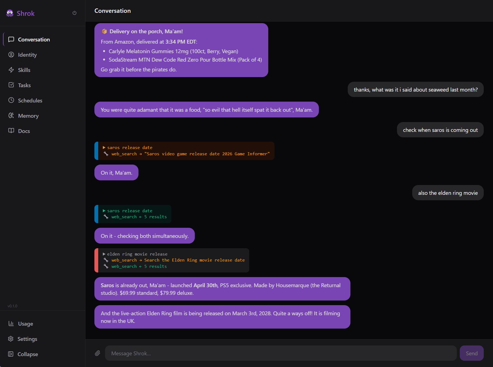

<h1> Shrok</h1>


[](https://nodejs.org)

[](https://discord.gg/n9DHxSCJb)



Shrok is a self-hosted personal agent that is:

- Never too busy to talk (all work happens in the background)
- Has the memory of an elephant (passively recalls anything you talked about previously, including whole conversations and exact phrasing - see [getshrok/infinite-context-window](https://github.com/getshrok/infinite-context-window))
- Cheap to run on higher tier models (it only sends what's relevant to the model each turn)
- Always the same entity, no matter which app you talk to it from (Discord/Slack/Telegram/WhatsApp/Zoho Cliq, and its own web interface)
- Designed for its capabilities to be extended through skills (curated repo at [getshrok/skills](https://github.com/getshrok/skills) to avoid malicious skills) 
- Can be set to do anything on a smart schedule (it can decide when something is appropriate to run)

Check out [the full overview](docs/overview.md), [the cheatsheet](docs/cheatsheet.md), and [the rest of the docs](docs/).

## Install

**macOS / Linux:**
```bash
curl -fsSL https://raw.githubusercontent.com/getshrok/shrok/main/scripts/install.sh | bash
```

**Windows (cmd or PowerShell):**
```
powershell -c "irm https://raw.githubusercontent.com/getshrok/shrok/main/scripts/install.ps1 | iex"
```

**Uninstall:** `bash ~/shrok/scripts/uninstall.sh` (macOS/Linux) or `& "$HOME\shrok\scripts\uninstall.cmd"` (Windows).

## Manual Install

```bash
git clone https://github.com/getshrok/shrok.git ~/shrok
cd ~/shrok
npm install
npm run setup
npm start
```

**Uninstall:** See the [manual uninstall doc](docs/user-guide/manual-uninstall.md).

## Docker

```bash
git clone https://github.com/getshrok/shrok.git ~/shrok
cd ~/shrok

mkdir -p ~/.shrok/workspace
cp .env.example ~/.shrok/workspace/.env && vim ~/.shrok/workspace/.env

docker compose up -d
```

All persistent state (database, identity, memory, skills, tasks) lives in `~/.shrok/workspace`, which is mounted as a volume. The dashboard is available at `http://localhost:8888`.

## Auto Start

Uses launchd, systemd --user, or task scheduler depending on the OS. See [auto-start docs](docs/internals/auto-start.md) for more info.

## Config

Can be configured via the settings in the dashboard or asking Shrok directly, or you can edit ~/.shrok/workspace/config.json and ~/.shrok/workspace/.env

## Cost

Shrok uses your own API keys. Usage footers show token counts and cost per response (off by default, toggle in settings).

## Prerequisites

The install scripts handle most dependencies automatically, but here's what is needed:

- macOS (Intel or Apple Silicon) or Linux (x86_64 or arm64) or Windows 10+
- Node.js 22+ (installed automatically on macOS/Linux if missing)
- Git (installed automatically on macOS/Linux if missing)
- ~1 GB disk space for the base install (mostly dependencies)

## Updating

You can ask it to update (it comes with a skill for it and works through updates to system skills that live in ~/.shrok as best it can), or just git pull and restart if you don't care about updating the system skills.

## Troubleshooting

Run `shrok doctor` to check on which area might be malfunctioning, or `shrok doctor --help` for more options.

## License/Contributing

[](https://github.com/getshrok/shrok/blob/main/LICENSE)

I created this because I wanted my own OpenClaw to mess around with, but I am open to any feedback or suggestions!
